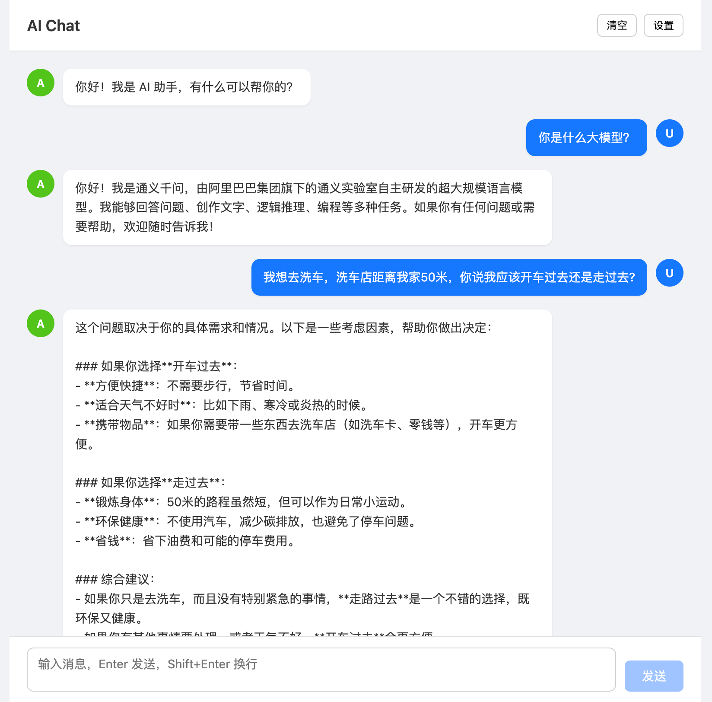
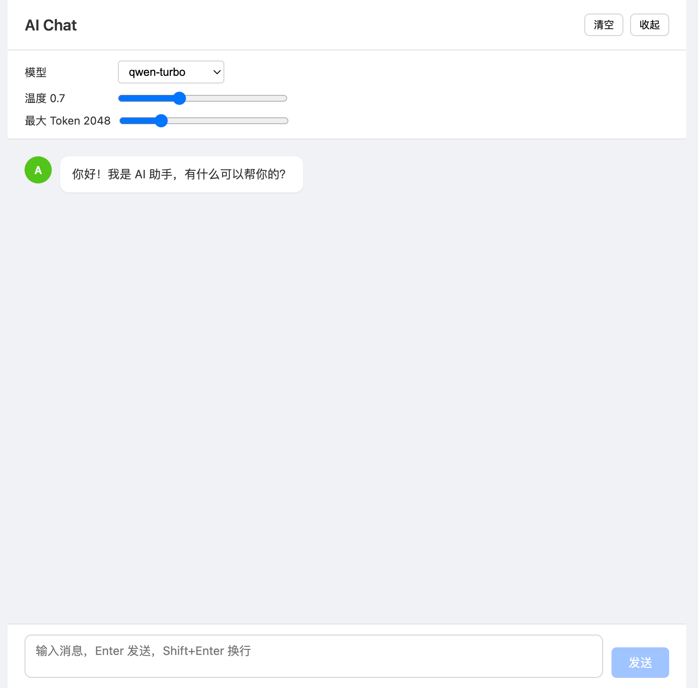

# AI Chat API — 大模型对话引擎

基于 FastAPI + React 构建的企业级 AI 对话平台，兼容 OpenAI 协议，开箱即用。

## 核心特性

- **多模型无缝切换** — 通义千问 / DeepSeek / GPT 等任意兼容 OpenAI 格式的模型，一键切换
- **流式实时响应** — SSE 流式推送，打字机效果，交互更流畅
- **智能上下文管理** — 根据模型窗口自动截断历史，无需担心 Token 超限
- **精细参数控制** — Temperature / Max Tokens 实时可调，灵活应对不同场景
- **跨域友好** — 开箱支持前后端分离开发，快速集成现有系统

## 快速开始

### 1. 配置

```bash
cp .env.example .env
# 编辑 .env 填入你的 API Key 和 Base URL
```

### 2. 启动后端

```bash
cd backend
python3 -m venv venv
source venv/bin/activate
pip install -r requirements.txt
uvicorn main:app --reload --port 8000
```

### 3. 启动前端

```bash
cd frontend
npm install
npm run dev
```

打开 `http://localhost:5173` 即可体验。

## 效果预览

| 对话界面 | 功能设置 |
|---------|---------|
|  |  |

## API 接口

### 普通对话

```bash
POST /chat
Content-Type: application/json

{
  "messages": [{"role": "user", "content": "你好"}],
  "model": "qwen-turbo",
  "temperature": 0.7,
  "max_tokens": 2048
}
```

### 流式对话

```bash
POST /chat/stream
Content-Type: application/json
```

返回 SSE 格式实时流，前端逐帧渲染。

## 项目结构

```
ai-agent/
├── backend/             # FastAPI 后端
│   ├── main.py          # API 入口
│   └── requirements.txt # Python 依赖
├── frontend/            # React 前端
│   ├── src/App.jsx      # 聊天界面
│   ├── src/App.css      # 样式
│   └── vite.config.js   # Vite 配置
├── .env                 # 环境配置
└── README.md
```

## 支持模型

| 模型 | 提供商 | 上下文窗口 |
|------|--------|-----------|
| qwen-turbo | 阿里云 | 128K |
| qwen-plus | 阿里云 | 128K |
| qwen-max | 阿里云 | 32K |
| deepseek-chat | DeepSeek | 64K |
| gpt-3.5-turbo | OpenAI | 16K |

## License

MIT
